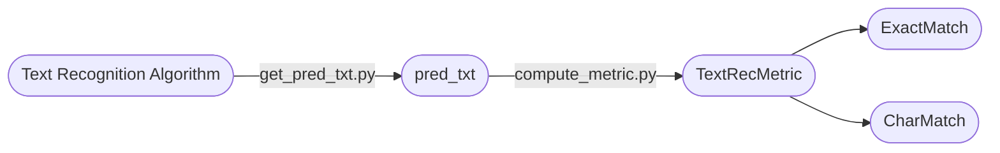

<div align="center">
  <div align="center">
    <h1><b>Text Recognition Metric</b></h1>
  </div>

<a href=""></a>
<a href="">=3.6,<3.12-aff.svg"></a>
<a href="https://pypi.org/project/text_rec_metric/"></a>
<a href="https://pepy.tech/project/text_rec_metric"></a>
<a href="https://semver.org/"></a>
<a href="https://github.com/psf/black"></a>

</div>


### 简介
该库用于计算`Exact Match`和`Char Match`两个指标，用来快速评测文本识别算法效果，与[text_rec_test_dataset](https://huggingface.co/datasets/SWHL/text_rec_test_dataset)配套使用。

指标计算代码参考：[PaddleOCR](https://github.com/PaddlePaddle/PaddleOCR/blob/667fda88ed16dd25be2a79723a71846de3f9bb90/ppocr/metrics/rec_metric.py#L22)

### 整体框架


### 指定数据集上评测
如果想要评测其他文本识别算法，需要将预测结果写入`pred.txt`中，格式为`预测文本\t真实文本\t耗时`，详细可参考[link](./pred.txt)。示例如下：
```text
动漫	动漫	0.665647029876709
上网	上网	0.6647390524546305
华茂	华茂	0.6621260245641073
```

### 示例（评测`rapidocr_onnxruntime==1.3.16`）
1. 安装运行环境
    ```bash
    pip install rapidocr_onnxruntime==1.3.16
    pip install datasets
    pip install text_rec_metric
    ```
2. 获得`pred.txt`文本文件
    ```python
    from pathlib import Path

    import cv2
    import numpy as np
    from datasets import load_dataset
    from rapidocr_onnxruntime import RapidOCR
    from tqdm import tqdm

    root_dir = Path(__file__).resolve().parent

    engine = RapidOCR()

    dataset = load_dataset("SWHL/text_rec_test_dataset")
    test_data = dataset["test"]

    content = []
    for i, one_data in enumerate(tqdm(test_data)):
        img = np.array(one_data.get("image"))
        img = cv2.cvtColor(img, cv2.COLOR_RGB2BGR)

        result, elapse = engine(img, use_det=False, use_cls=False, use_rec=True)
        if result is None:
            rec_res = ""
            elapse = 0
        else:
            rec_res, elapse = result[0]

        gt = one_data.get("label", None)
        content.append(f"{rec_res}\t{gt}\t{elapse}")

    with open("pred.txt", "w", encoding="utf-8") as f:
        for v in content:
            f.write(f"{v}\n")
    ```
3. 计算指标
    ```python
    from text_rec_metric import TextRecMetric

    metric = TextRecMetric()

    pred_path = "pred.txt"
    metric = metric(pred_path)
    print(metric)
    ```
4. 得到结果
    ```bash
    {'ExactMatch': 0.8323, 'CharMatch': 0.9355, 'avg_elapse': 0.6836}
    ```


### 指标说明
#### Exact Match (精确匹配准确率)
$$
Exact\ Match = \frac{1}{N}\sum_{i=0}^{N} s(p_{i}, g_{i})
$$

$$
s(p_{i}, g_{i})  = \begin{cases}
    1 & \text{if } p_{i} = g_{i} \\
    0 & \text{otherwise }
\end{cases}
$$


- $N$: 总的文本行个数
- $p_{i}$: 第 $i$ 条文本行识别结果
- $g_{i}$: 第 $i$ 条文本行对应的真实标签

#### Char Match (字符级准确率)
$$
Char\ Match = 1 - \frac{1}{N} \sum_{i=0}^{N} s(p_{i}, g_{i})
$$

$$
s(p_{i}, g_{i}) = 1 - NL(p_{i}, g_{i})
$$

$$
NL(p_{i}, g_{i}) = \frac{Levenshtein(p_{i}, g_{i})}{\max \big(len(p_{i}), len(g_{i}) \big)}
$$

- $N$: 总的文本行个数
- $p_{i}$: 第 $i$ 条文本行识别结果
- $g_{i}$: 第 $i$ 条文本行对应的真实标签
- $Levenshtein(x, y)$: 求字符串 $x$ 和字符串 $y$ 的编辑距离
- $max(x, y)$: 求 $x$ 和 $y$ 的最大值
- $len(x)$: 求所给字符串 $x$ 的长度

